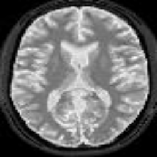
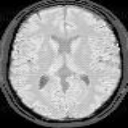
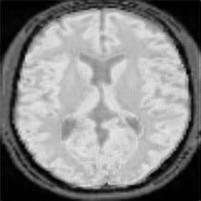
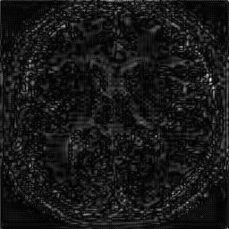

# Deep-Learning-Based-MR-Image-Re-parameterization

[Abhijeet Narang](https://www.linkedin.com/in/abhijeet-narang-63b419175/) &nbsp;&nbsp; [Abhigyan Raj](https://www.linkedin.com/in/abhigyan-raj-023537145/) &nbsp;&nbsp; [Mihaela Pop](http://individual.utoronto.ca/mihaelapop/index.html) &nbsp;&nbsp; [Mehran Ebrahimi](https://www.linkedin.com/in/mehran-ebrahimi-a6a92711/)

This is the official implemetation of our BIOENG'22 paper **Deep Learning-Based MR Image Re-parameterization**.

Magnetic resonance (MR) image reparameterization refers to the process of generating via simulations of an MR image with a new set of MRI scanning parameters. Different parameter values generate distinct contrast between different tissues, helping identify pathologic tissue. Typically, more than one scan is required for diagnosis; however, acquiring repeated scans can be costly, time-consuming, and difficult in patients. Thus, using MR image re-parameterization to predict and estimate the contrast in these imaging scans can be an effective alternative. In this work, we propose a novel deep learning (DL) based convolutional model for MRI re-parameterization. Based on our preliminary results, DL-based techniques hold the potential to learn the non-linearities that govern the re-parameterization.

### Dataset
- We used MRiLab which is an MRI Simulator to generate these synthetic brain scans. We use these for training and testing.
- We also use Brainweb which is a simulated brain database that contains a set of realistic MRI data volumes produced by an MRI Simulator. We use these only for testing.

## Network Architecure
To be added

You can download the trained weights from here -  
[Weights for END(Autoencoder) model](https://drive.google.com/file/d/1vdS1uEPm_9HkCiL0jbchnj-h16RlWSxN/view?usp=sharing). 
[Weights for Default-to-Param model](https://drive.google.com/file/d/1NcmYU1XXc-FEofpzWRbVlk_Kyvc9e170/view?usp=sharing). 
[Weights for Param-to-Param model](https://drive.google.com/file/d/1C_5h0n2P89eHxtOILiNsNYxmK7Ibgpvw/view?usp=sharing). 

## MRiLab Results
### Default-to-Param Model
   

